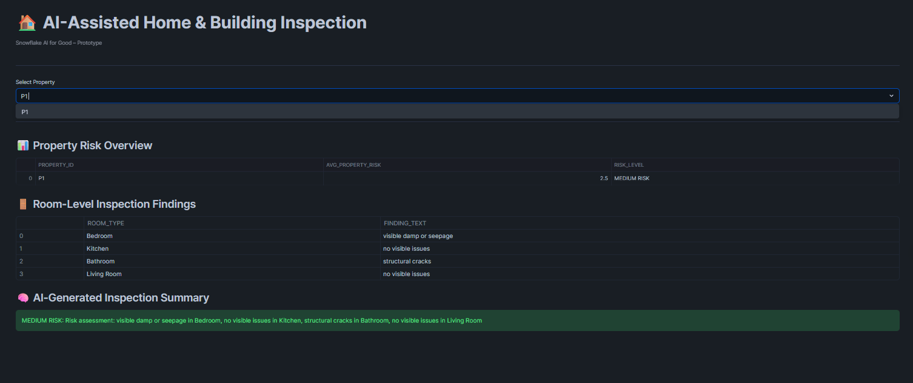

# ai-assisted-home-inspection
AI-Assisted Home &amp; Building Inspection – Snowflake AI for Good Hackathon

# AI-Assisted Home & Building Inspection  
### Snowflake AI for Good Hackathon – Round-1 Prototype

---

## 🔍 Problem Statement
Home buyers and tenants often have limited visibility into hidden issues in new or
under-construction buildings such as damp walls, exposed wiring, or structural cracks.
Although inspection notes and photos exist, these findings are rarely analysed
systematically to assess overall risk.

---

## Proposed Solution
This project presents an **AI-assisted inspection workspace built natively on Snowflake**.
The system analyses inspection notes and image defect labels to:

- Identify potential building defects
- Aggregate findings into room-level and property-level risk scores
- Generate **plain-language inspection summaries** understandable by non-technical users

The solution helps families, tenants, and regulators identify unsafe housing early.

---

## System Architecture (High Level)
1. Inspection data stored in Snowflake tables  
2. AI-assisted defect classification on inspection notes  
3. Risk scoring at room and property level using SQL  
4. Plain-language summaries generated from findings  
5. Insights visualised using Snowflake-native Streamlit  

---

## Key Features
- AI-style defect classification from inspection text  
- Image defect labels used as metadata (e.g., crack, leak, exposed wiring)  
- Explainable room-level and property-level risk scoring  
- Human-readable inspection summaries  
- Interactive Streamlit dashboard running inside Snowflake  

---

##  Tech Stack
- **Snowflake** (Databases, Tables, Views, SQL)
- **Snowflake Intelligence / AI-style SQL** (Cortex-ready logic)
- **Streamlit (Snowflake-native)** for visualization
- **Synthetic inspection dataset** for prototyping

> Note: AI classification logic is implemented using explainable SQL rules due to
regional Cortex availability. The architecture is fully compatible with
`AI_CLASSIFY()` when enabled.

---

## 📸 Prototype Screenshots

### Streamlit Dashboard Overview

---

## 🌍 AI for Good Impact
This solution supports safer housing by enabling early detection of construction
defects, improving transparency for buyers and tenants, and assisting regulators
in monitoring residential building quality.

---

##  Repository Structure
sql/ → Snowflake setup, AI logic, risk scoring, summaries
streamlit/ → Snowflake Streamlit application
screenshots/→ Visual proof of working prototype

---

## Status
✔ Working Snowflake backend  
✔ AI-assisted risk analysis  
✔ Streamlit prototype  
✔ Ready for Round-1 evaluation
